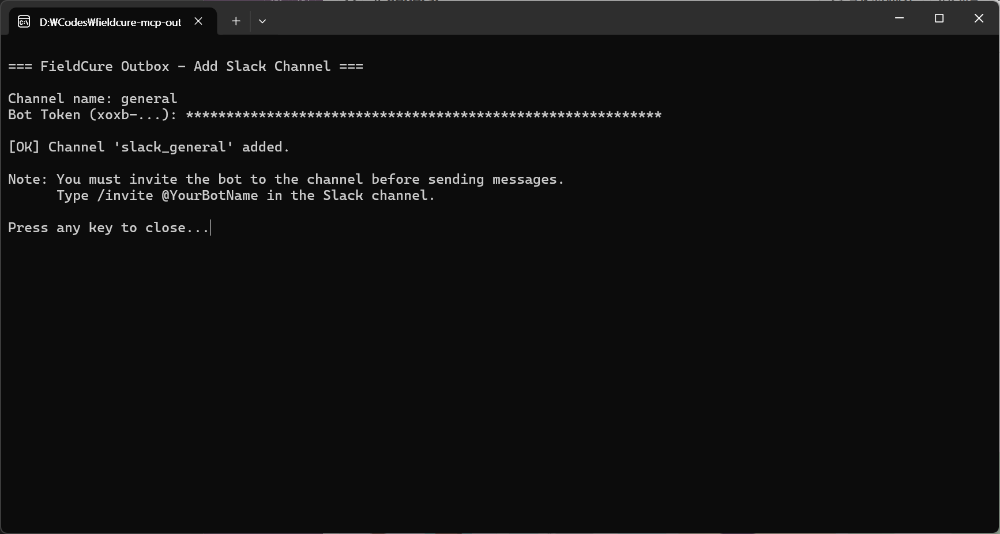
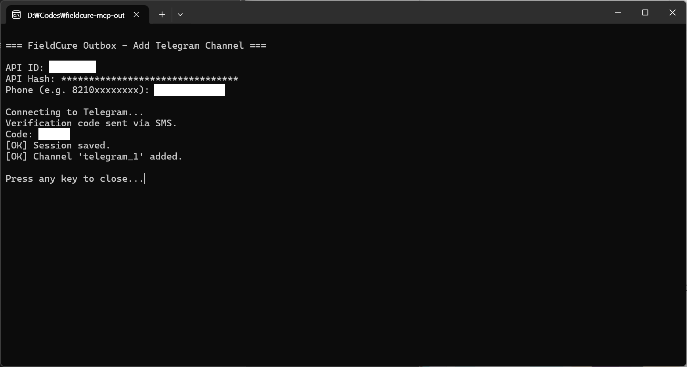
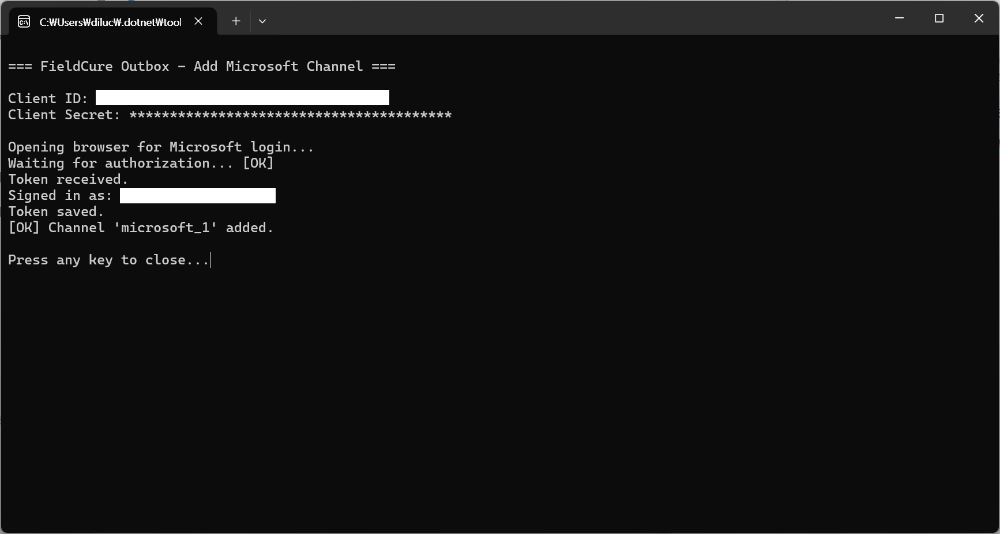
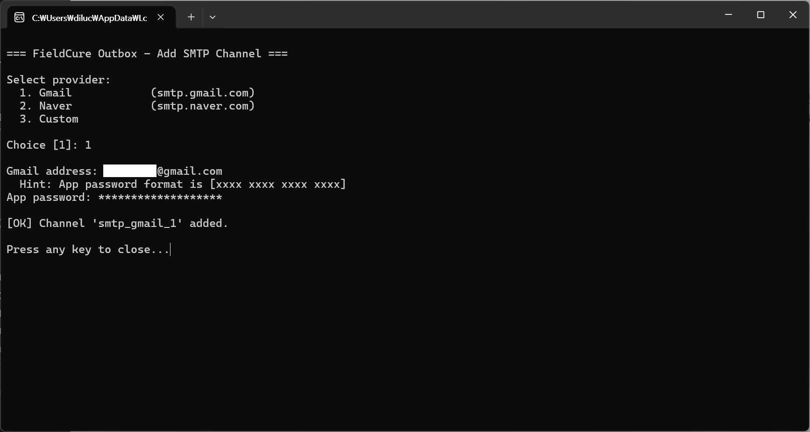
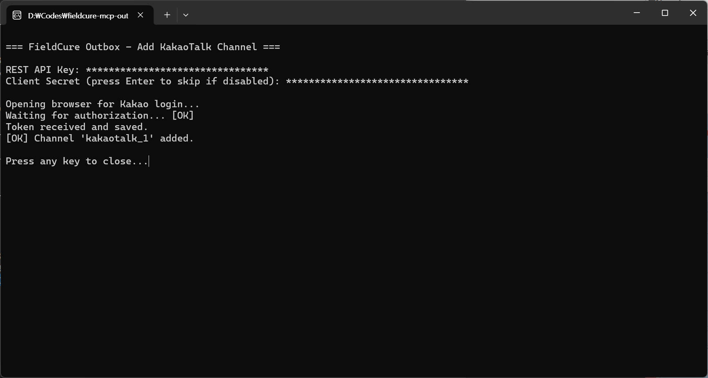

# FieldCure MCP Outbox Server

[](https://www.nuget.org/packages/FieldCure.Mcp.Outbox)
[](https://github.com/fieldcure/fieldcure-mcp-outbox/blob/main/LICENSE)

A multi-channel messaging [Model Context Protocol (MCP)](https://modelcontextprotocol.io) server that sends messages through Slack, Telegram, Email (Gmail, Naver, Microsoft Graph API), and KakaoTalk. Built with C# and the official [MCP C# SDK](https://github.com/modelcontextprotocol/csharp-sdk).

## Features

- **5 messaging channels** — Slack, Telegram, SMTP (Gmail, Naver), Microsoft Graph API (Outlook / M365), KakaoTalk
- **4 MCP tools** — `list_channels`, `add_channel`, `send_message`, `remove_channel`
- **Secure credential storage** — secrets stored in Windows Credential Manager (DPAPI), never exposed to LLM
- **CLI channel setup** — interactive console for credential entry, launched as a subprocess
- **SMTP presets** — Gmail, Naver with one-command setup
- **Microsoft Graph API** — OAuth 2.0 browser flow for Outlook / M365 email with automatic token refresh
- **KakaoTalk OAuth** — localhost callback flow with automatic token refresh
- **Telegram Client API** — send to Saved Messages via WTelegramClient
- **Stdio transport** — standard MCP subprocess model via JSON-RPC over stdin/stdout

## Why Outbox?

Existing MCP servers are channel-specific — one for Slack, another for Gmail, yet another for Telegram. Each requires separate installation, configuration, and the LLM must know which tool to call for each channel.

Outbox takes a different approach:

- **One tool, multiple channels** — `send_message` abstracts away channel differences. The LLM doesn't need to know Slack API vs SMTP vs Kakao REST.
- **Credential isolation** — Secrets are entered through a separate console process and stored in Windows Credential Manager (DPAPI). They never flow through MCP stdio, so they're never visible to the LLM.
- **Single install** — `dotnet tool install -g` gives you 4 channels. No need to install and configure separate servers per channel.
- **KakaoTalk support** — Currently the only MCP server with KakaoTalk messaging, essential for Korean users.

## Installation

### dotnet tool (recommended)

```bash
dotnet tool install -g FieldCure.Mcp.Outbox
```

After installation, the `fieldcure-mcp-outbox` command is available globally.

### From source

```bash
git clone https://github.com/fieldcure/fieldcure-mcp-outbox.git
cd fieldcure-mcp-outbox
dotnet build
```

## Requirements

- [.NET 8.0 Runtime](https://dotnet.microsoft.com/download/dotnet/8.0) or later
- Windows (required for Credential Manager)

## Configuration

### Claude Desktop

Add to `claude_desktop_config.json`:

```json
{
  "mcpServers": {
    "outbox": {
      "command": "fieldcure-mcp-outbox"
    }
  }
}
```

### VS Code (Copilot)

Add to `.vscode/mcp.json`:

```json
{
  "servers": {
    "outbox": {
      "command": "fieldcure-mcp-outbox"
    }
  }
}
```

### From source (without dotnet tool)

```json
{
  "mcpServers": {
    "outbox": {
      "command": "dotnet",
      "args": [
        "run",
        "--project", "C:\\path\\to\\fieldcure-mcp-outbox\\src\\FieldCure.Mcp.Outbox"
      ]
    }
  }
}
```

## Tools

| Tool | Description | Confirmation |
|------|-------------|:------------:|
| `list_channels` | List all configured messaging channels | — |
| `add_channel` | Add a new channel (opens setup console for credential entry) | — |
| `send_message` | Send a message through a configured channel | Required |
| `remove_channel` | Remove a channel and its stored credentials | Required |

## Channel Setup

All channel credentials are stored securely in Windows Credential Manager (DPAPI).
No secrets are exposed in conversation history or config files.

---

### Slack

**What it does:** Sends messages to a Slack channel via Bot API.

**Prerequisites:**
1. A Slack workspace (free plan is fine, single-person workspace works)
2. A Slack App with Bot Token

**Setup Steps:**

1. Go to [api.slack.com/apps](https://api.slack.com/apps) and click **Create New App** → **From scratch**
2. Enter an App Name (e.g. "AssistStudio") and select your workspace
3. In the left menu, go to **OAuth & Permissions**
4. Under **Bot Token Scopes**, click **Add an OAuth Scope** and add `chat:write`
5. Scroll up and click **Install to Workspace** → **Allow**
6. Copy the **Bot User OAuth Token** (`xoxb-...`)
7. **Important:** In your Slack workspace, invite the bot to the channel where you want to send messages. Type `/invite @YourAppName` in the channel (e.g., `/invite @AssistStudio` if you named your app "AssistStudio" in step 2).

**Add Channel:**

```bash
fieldcure-mcp-outbox add slack
```

You will be prompted for:
- **Channel name:** The default Slack channel name (e.g. `general`, `dev-alerts`)
- **Bot Token:** The `xoxb-...` token from step 6

> **Note:** The bot must be invited to the channel before it can send messages.
> Type `/invite @YourAppName` in the channel (use the App Name from step 2).



---

### Telegram

**What it does:** Sends messages to yourself (Saved Messages) via Telegram Client API.

**Prerequisites:**
1. A Telegram account with a registered phone number
2. Telegram API credentials (API ID and API Hash)

**Setup Steps:**

1. Go to [my.telegram.org](https://my.telegram.org) and log in with your phone number
2. Click **API development tools**
3. Fill in the form:
   - **App title:** Any name (e.g. "AssistStudio")
   - **Short name:** 5-32 alphanumeric characters (e.g. "AStudio")
   - **Platform:** Desktop
   - **URL / Description:** Leave empty
4. Click **Create application**
5. Note down the **API ID** (numeric) and **API Hash** (string)

> **Note:** Test/Production configuration values on the same page are NOT needed.

**Add Channel:**

```bash
fieldcure-mcp-outbox add telegram
```

You will be prompted for:
- **API ID:** The numeric ID from step 5
- **API Hash:** The hash string from step 5
- **Phone:** Your phone number in international format (e.g. `8210xxxxxxxx`)
- **Verification code:** Enter the code sent to your Telegram app or via SMS

A session file is created after successful authentication. Subsequent use does not require re-authentication.



---

### Email

**What it does:** Sends emails via SMTP (Gmail, Naver, Custom) or Microsoft Graph API (Outlook / Microsoft 365).

**Add Channel (SMTP):**

```bash
fieldcure-mcp-outbox add smtp
```

A provider menu will be displayed:

```
Select provider:
  1. Gmail          (smtp.gmail.com)
  2. Naver          (smtp.naver.com)
  3. Custom
```

You can also use shortcut commands:

```bash
fieldcure-mcp-outbox add gmail
fieldcure-mcp-outbox add naver
```

**Add Channel (Microsoft Graph API):**

```bash
fieldcure-mcp-outbox add microsoft
```

#### Gmail

**Prerequisites:**
1. A Gmail account with **2-Step Verification** enabled
2. An **App Password** (NOT your regular Google password)

**Getting an App Password:**
1. Go to [myaccount.google.com/security](https://myaccount.google.com/security)
2. Ensure 2-Step Verification is ON
3. Go to [myaccount.google.com/apppasswords](https://myaccount.google.com/apppasswords)
4. Enter an app name (e.g. "Outbox") → **Create**
5. Copy the 16-character password (e.g. `abcd efgh ijkl mnop`)
6. Enter it without spaces when prompted

You will be prompted for:
- **Gmail address:** Your Gmail email address
- **App password:** The 16-character app password

#### Outlook / Microsoft 365

> **Note:** Microsoft has [deprecated basic authentication](https://learn.microsoft.com/en-us/exchange/clients-and-mobile-in-exchange-online/deprecation-of-basic-authentication-exchange-online) for SMTP. This provider uses **Microsoft Graph API** with OAuth 2.0 instead of SMTP.

For both personal accounts (@outlook.com, @hotmail.com, @live.com) and business/organization Microsoft 365 accounts.

**Prerequisites:**
1. A Microsoft account (personal or work/school)
2. An Azure Entra ID app registration with **Mail.Send** permission

**Setting up Azure Entra ID App:**
1. Go to [entra.microsoft.com](https://entra.microsoft.com) → **Entra ID** → **앱 등록** → **새 등록**
2. Enter a name (e.g. `outbox`)
3. Under **지원되는 계정 유형**, select **모든 Entra ID 테넌트 + 개인 Microsoft 계정** (to support both personal and work accounts)
4. Under **리디렉션 URI**, select **웹** and enter `http://localhost:9876/callback`
5. Click **등록**
6. Note the **애플리케이션(클라이언트) ID** on the overview page
7. Go to **API 사용 권한** → **권한 추가** → **Microsoft Graph** → **위임된 권한** → search `Mail.Send` → check it → **권한 추가**
8. Go to **인증서 및 암호** → **새 클라이언트 비밀** → enter a description → **추가** → copy the **값(Value)** (shown only once)

**Add Channel:**

```bash
fieldcure-mcp-outbox add microsoft
```

You will be prompted for:
- **Client ID:** The application (client) ID from step 6
- **Client Secret:** The client secret value from step 8
- A browser window will open for Microsoft sign-in and consent



#### Naver

**Prerequisites:**
1. A Naver account with POP3/SMTP or IMAP/SMTP enabled
2. **2-Step Verification** enabled on your Naver account
3. An **App Password** (NOT your regular Naver password)

**Enabling SMTP:**
1. Go to [Naver Mail](https://mail.naver.com) → **환경설정** → **POP3/IMAP 설정**
2. Under **POP3/SMTP 사용** (or **IMAP/SMTP 설정**), select **사용함**
3. Click **저장**

> **Note:** If POP3/SMTP is unused for 90 days, Naver automatically disables it.

**Enabling 2-Step Verification & Getting an App Password:**
1. Go to [Naver ID Security Settings](https://nid.naver.com/user2/help/myInfoV2?m=viewSecurity&lang=ko_KR) (네이버ID → **보안설정**)
2. Click **설정** next to **2단계 인증**
3. Re-enter your password, select your mobile device, and approve the push notification on the Naver app
4. After 2-Step Verification is enabled, click **보안설정 확인** → **보안설정더보기** to go to the management page
5. Under **애플리케이션 비밀번호 관리**, select **직접 입력** → enter a name (e.g. `outbox`) → click **생성하기**
6. Copy the 12-character app password (uppercase letters and digits, e.g. `AB3CDE7FGHKL`, shown only once)

> **Note:** 2-Step Verification requires the Naver app (v8.6.0+) installed on your smartphone.

Uses `smtp.naver.com:465` with SSL.

**Add Channel:**

```bash
fieldcure-mcp-outbox add naver
```

You will be prompted for:
- **Naver ID:** Your Naver email address (e.g. `yourname@naver.com`)
- **App password:** The 12-character uppercase app password from step 6 (NOT your login password)

#### Custom SMTP

For any other SMTP server.

You will be prompted for:
- **Host:** SMTP server hostname
- **Port:** SMTP port (default: 587)
- **Use TLS:** y/n (default: y)
- **Username:** SMTP username
- **Password:** SMTP password



---

### KakaoTalk

**What it does:** Sends messages to yourself via KakaoTalk "Send to Me" API.

**Prerequisites:**
1. A Kakao account
2. A Kakao Developers application with Messaging API enabled

**Setup Steps:**

1. Go to [developers.kakao.com](https://developers.kakao.com) and log in
2. Go to **My Applications** → **Add Application** → Enter app name → Save
3. Go to **Product Settings** → **Kakao Login** → Set status to **ON**
4. Go to **Product Settings** → **Kakao Login** → **Consent Items**
   - Find **카카오톡 메시지 전송** (`talk_message`) under **접근권한**
   - Click **설정** → Select **이용 중 동의** → Enter a purpose (e.g. "AI agent notification") → Save
5. Go to **App Settings** → **Platform Key** → Click on your REST API key
   - Copy the **REST API Key**
   - Under **카카오 로그인 리다이렉트 URI**, add: `http://localhost:9876/callback`
   - Under **클라이언트 시크릿**, copy the **Client Secret** code for 카카오 로그인
   - Ensure 활성화 is set to **ON**
   - Click **저장**

> **Critical:** The redirect URI must be exactly `http://localhost:9876/callback` — no trailing slash.

**Add Channel:**

```bash
fieldcure-mcp-outbox add kakaotalk
```

You will be prompted for:
- **REST API Key:** From step 5
- **Client Secret:** From step 5 (press Enter to skip if disabled, but new apps have it enabled by default)

After entering credentials:
1. Your browser will automatically open the Kakao login page
2. Log in with your Kakao account and grant permissions
3. The browser will show "Authorization successful!" — you can close it
4. The console will confirm the channel was added

**Token Management:**
- Access tokens are automatically refreshed when expired
- If the refresh token also expires, `send_message` will return an error
- Re-run `add kakaotalk` to re-authorize



## CLI Commands

```bash
fieldcure-mcp-outbox                      # Start MCP server (stdio)
fieldcure-mcp-outbox add slack            # Add Slack channel
fieldcure-mcp-outbox add telegram         # Add Telegram channel
fieldcure-mcp-outbox add gmail            # Add Gmail SMTP channel
fieldcure-mcp-outbox add naver            # Add Naver SMTP channel
fieldcure-mcp-outbox add smtp             # Add custom SMTP channel
fieldcure-mcp-outbox add microsoft        # Add Microsoft (Outlook/M365) channel
fieldcure-mcp-outbox add kakaotalk        # Add KakaoTalk channel
fieldcure-mcp-outbox list                 # List configured channels
fieldcure-mcp-outbox remove <id>          # Remove a channel
```

## Data Storage

| Data | Location |
|------|----------|
| Channel metadata | `%LOCALAPPDATA%\FieldCure\Mcp.Outbox\channels.json` |
| Secrets | Windows Credential Manager (DPAPI) |
| Telegram sessions | `%LOCALAPPDATA%\FieldCure\Mcp.Outbox\sessions\` |
| OAuth tokens (Microsoft, KakaoTalk) | `%LOCALAPPDATA%\FieldCure\Mcp.Outbox\tokens\` |

## Project Structure

```
src/FieldCure.Mcp.Outbox/
├── Program.cs                  # Entry point: MCP server vs CLI branching
├── Channels/
│   ├── IChannel.cs             # Channel interface + SendRequest/SendResult
│   ├── ChannelFactory.cs       # Channel instantiation by type
│   ├── SlackChannel.cs         # Slack Web API
│   ├── TelegramChannel.cs      # WTelegramClient
│   ├── SmtpChannel.cs          # MailKit SMTP
│   ├── MicrosoftChannel.cs     # Microsoft Graph API
│   └── KakaoTalkChannel.cs     # Kakao REST API
├── Tools/
│   ├── ListChannelsTool.cs     # list_channels
│   ├── AddChannelTool.cs       # add_channel
│   ├── RemoveChannelTool.cs    # remove_channel
│   └── SendMessageTool.cs      # send_message
├── Setup/
│   ├── SetupRunner.cs          # CLI router
│   ├── ConsoleHelper.cs        # Masked input, prompts
│   ├── SlackSetup.cs
│   ├── TelegramSetup.cs
│   ├── SmtpSetup.cs
│   ├── MicrosoftSetup.cs
│   └── KakaoTalkSetup.cs
└── Configuration/
    ├── ChannelStore.cs         # channels.json persistence
    ├── CredentialManager.cs    # Windows Credential Manager wrapper
    └── SmtpPresets.cs          # SMTP preset definitions
```

## Development

```bash
# Build
dotnet build

# Test
dotnet test

# Pack as dotnet tool
dotnet pack src/FieldCure.Mcp.Outbox -c Release
```

## License

[MIT](LICENSE)
